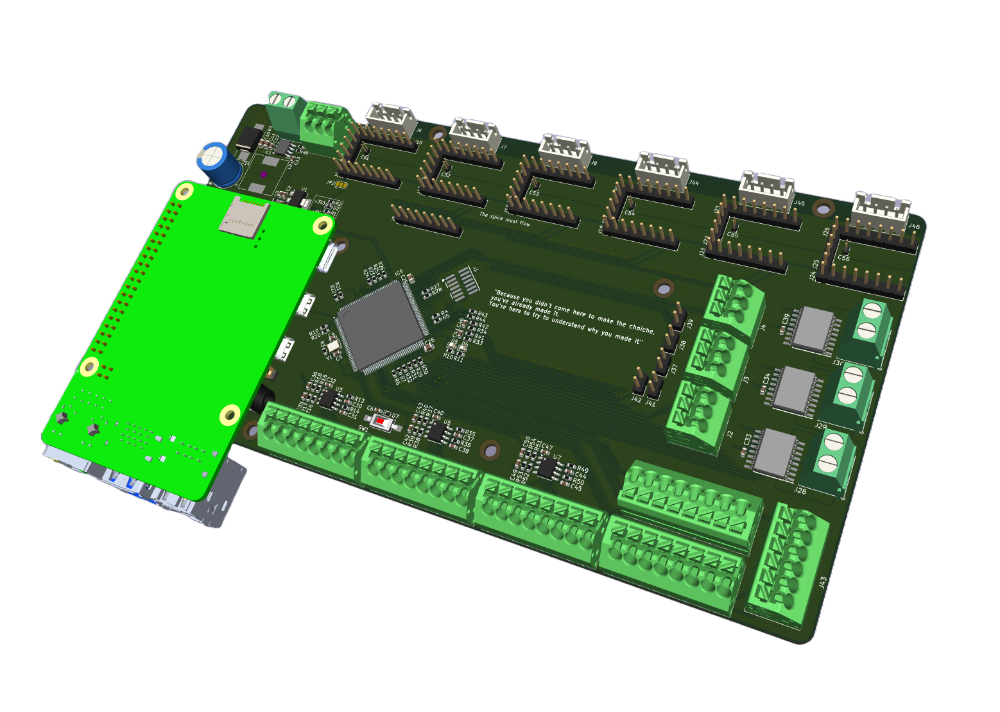
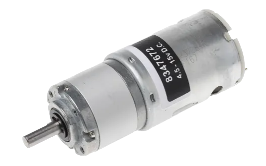
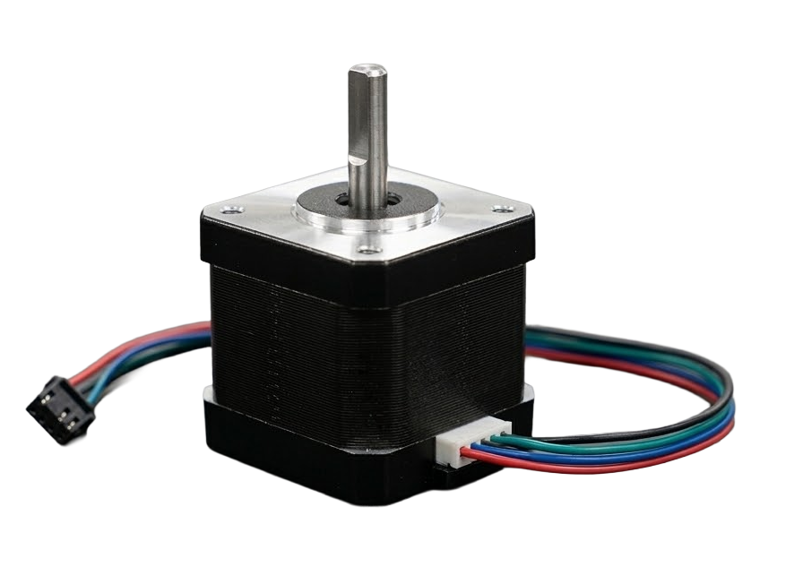

# Axes Controller Board

The **Axes Controller Board** (**ACB**) represents the neural center of the Dedalus mechatronic system. It serves as the high-speed bridge between the high-level trajectories planning generated by the Raspberry Pi 5 and the deterministic, real-time actuation of the physical motors.

Unlike standard commercial 3D printing controller boards, the ACB is specifically engineered to handle complex, closed-loop dynamics. By offloading the computationally heavy path planning to the Raspberry Pi and reserving the STM32H7 MCU for hard real-time control, the board achieves a level of synchronization and responsiveness capable of managing high-inertia loads with micrometric precision. The communication layer relies on a high-bandwidth SPI interface, allowing the board to consume motion "blocks" and execute them through a multi-stage control architecture.

The ACB is designed to simultaneously manage brushed DC motors for high-torque linear motion and Stepper motors for precision orientation/positioning and extrusion.

The selected motors for the system are:

| Geared DC Motor | Stepper Motor |
|---|---|
| |  |

## DC motors control
In order to perform properly the PIDs, the board implements a full state-space feedback system, sensing multiple quantities to close the loop on velocity and position:

* `AS5048A` as rotative encoders mounted along each motor axis as feedback on angular velocity;
* `RLCI2C` as linear magnetic encoders mounted along the axes to provide absolute positioning feedback, bypassing mechanical inaccuracies such as belt stretch or gearbox backlash;
* `ACS37800` as current sensors in order to monitor the real-time flowing current that is proportional to the motor torque.

This 3 sensors are managed for each DC motor, that in total are 3:

* A single DC motor for the X axis (extruder axis);
* A single DC motor for the Y axis (printing plate axis).

The 3 DC motors are then actuated thanks to an external double-H-bridge driver in a IBT-4 configuration. The `Axes Controller Board`'s MCU drives it using 2 complementary PWM signals for each motor, in order to select the rotation direction (CW/CCW). The PID algorithm outputs the commanding signal that is then written inside the CCR register (`Capture Compare  Register`) that is proportional to the duty cycle.

## Stepper motors control
Stepper motors are actuated thanks to `TMC` drivers, that implement micro-stepping and STEP/DIR interface. They are driven by the MCU using these 2 signals while correcting the STEP position using the rotative encoder.
The used stepper motors configuration is:

* 2 steppers for Z positioning;
* 2 steppers for global plate pitch orientation;
* 1 stepper for local plate yaw orientation;
* 1 stepper for plastic material flow.

### DMA
The DMA of `STM32H723ZGT6` is used as follow:

* interface with SPI1 for `Raspberry Pi5` communication;
* interface with SPI2 for 3 daisy-chain-configured rotative encoders;
* interface with SPI3 for the other 3 daisy-chain-configured rotative encoders;
* interface with SPI4 for current sensor readings.

## Firmware Architecture
The motion control of Dedalus is managed by a custom bare-metal firmware developed for the STM32H7 architecture, designed to handle high-frequency control loops.

### DMA Data Acquisition
To eliminate jitter and CPU overhead during sensor communication, the system utilizes DMA on the SPI1 bus configured in Daisy Chain.

* High-Speed SPI1 (10 kHz): At each system timer clock cycle, a DMA reception is triggered to simultaneously read position data from the movement axes rotary encoders:
* since the H7 is equipped with an L1 cache, the firmware performs an `SCB_InvalidateDCache_by_Addr` operation before processing the `spi1_rx_buf`. This ensures the CPU reads the fresh data just written by the DMA into RAM.

### Inner Velocity Loop
The velocity loop is critical for the dynamic stability of the brushed DC motors.

* It runs at every occurrence of the Timer 6 interrupt ($dt=0.0001s$);
* it receives a composite velocity setpoint, consisting of the position feedback plus the feedforward from the `Raspberry Pi`;
* the firmware calculates the acceleration contribution (Ka​) in real-time. This is derived from the smooth motion profile to overcome the inertia of the 3 kg cradle before a velocity error even occurs;
* it directly generates the `PWM` signal sent to the `CCR` registers of Timer 1.

### Outer Position Loop
The position loop manages absolute spatial precision by reading the `RLCI2C` linear encoders from RLS.

* It runs every 10 cycles of the velocity loop using a `pid_counter`;
* it reads the real position via the H7's hardware encoder inputs (`Timer 2` and `Timer 3`);
* it calculates the corrective velocity required to nullify the position error relative to the interpolated target received from the `Raspberry Pi`.
* thanks to the 10-micron resolution of the RLS sensors, this loop ensures the machine maintains its nominal coordinate by correcting for mechanical backlash or belt flex;

# Mechanical Structure
The mechanical skeleton is a `Creality CR10 Max` which has a wide potential printing volume that is fundamental for letting the plate rotate and move.

On the Y axis, linear guides are mounted while replacing the old bearings-based carts. A single DC motor for each axis moves the plate structure along the Y direction, while on the carts are mounted one stepper motor each, which are devoted to orintate the pitch angle of the plate. The inner stepper (for the local yaw), is mounted such as the baricenter of the structure is aligned with the pitch rotating axis. It allows to load the stepper motors just with the structure inertia.