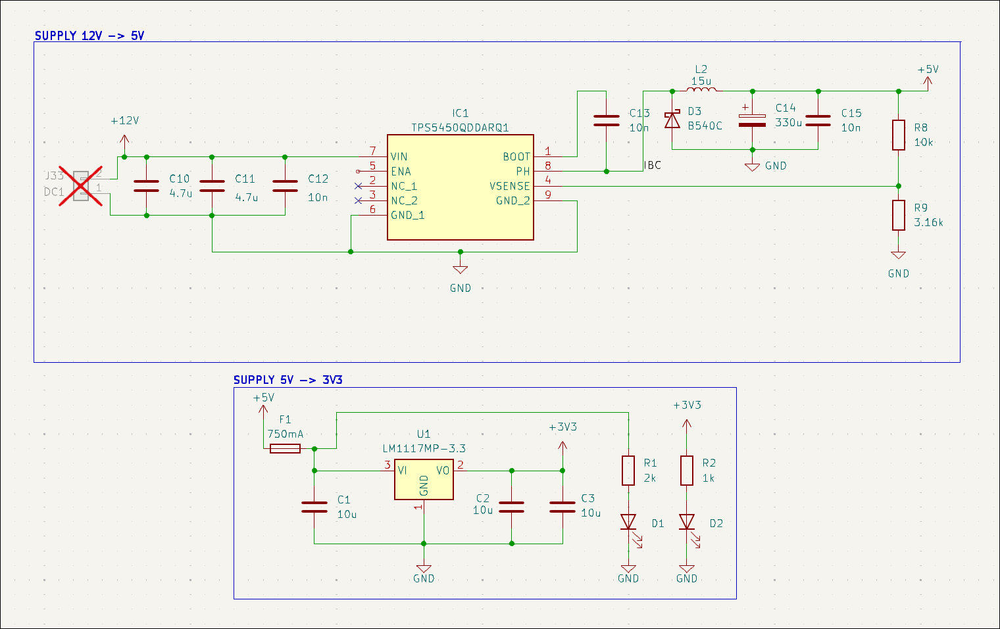

# Axes Controller Board - Introduction -

Standard 3D printers rely on simple Cartesian kinematics and open-loop
stepper motors. However, upgrading to a 5-axis non-planar printing
system introduces heavy custom mechanisms, significant rotational
inertia, and the need for absolute spatial accuracy. To overcome this
need, the Axes Controller Board (ACB) borns. The architectural
philosophy behind the ACB is straightforward: strict computational
decoupling. The Raspberry Pi 5 acts as the brain, performing the heavy
mathematics for S-profile interpolation, path planning, `GCode` parsing.
Meanwhile, the ACB acts as the working force, executing the motor
commands in hard real-time and reacting to sensor feedback within
fractions of a millisecond. Computational decoupling is applied on the
microcontroller as well: the CPU is utilized only for control
computations, while data acquisition is devoted to DMA or Timers.\

# Hardware Design

The PCB was designed to be highly integrated, eliminating messy wiring.
Instead of connecting the Raspberry Pi via standard USB cables, the Pi
mounts directly onto the ACB as a daughterboard and the stepper motors'
drivers as well.

The main power comes from a 400W AC to 12V DC power supply unit, that
results to be the only cable to plug to the AC.\

## Power Supply Stage

In order to deliver power and eliminate ground loops, a custom onboard
DC-DC buck converter steps down the main power supply and feeds clean 5V
and 3.3V power to Raspberry Pi directly through its GPIO headers and the
STM32H7 microcontroller respectively.

For this case, `TPS5450-Q1` from *Texas' Instruments* is used. This IC
features up to 36V DC input and, most important, up to 5A as output
current at 5V. This is a fundamental characteristic because of the high
sensitivity of the Raspberry's GPIO supply. Indeed, 5.1V is required in
order to be robust over voltage drops, for example during compilations
or heavy computations periods. Then, a 5V to 3.3V LDO is used in order
to step down the main DCDC supply to a stable and reliable 3.3V for the
microcontroller and sensors.\

### Power Consumption and Thermal Considerations

The Raspberry Pi 5 under heavy multi-core load can experience current
spikes up to 3.0A at 5V ($\approx 15$W). The `TPS5450-Q1` ensures a
maximum continuous output of 5A (25W), providing a robust 40% safety
margin. This headroom is critical to prevent voltage drops that would
otherwise trigger the Pi's under-voltage mechanism or cause unexpected
CPU reboots.

On the 3.3V logic side, the `STM32H7` running at its peak frequency of
550 MHz, combined with the SPI rotary encoders and linear sensors
supply, draws an estimated maximum continuous current of 300--400 mA.
Because this stage is powered via a linear LDO regulator fed by the 5V
rail, the IC must physically dissipate the voltage drop as heat. The
theoretical maximum power dissipation $P_{diss}$ is calculated as:

$$P_{diss} = (V_{in} - V_{out}) \times I_{load} = (5.0\text{V} - 3.3\text{V}) \times 0.4\text{A} \approx 0.68\text{W}$$
While 0.68 W is a manageable thermal load for a modern SMD package, it
requires careful thermal routing. To handle both the DC-DC switching
losses and the LDO linear dissipation without relying on external
heatsinks, the ACB's 4-layer PCB architecture leverages its solid
internal GND layers. Various thermal vias connect the ICs' exposed pads
directly to these copper planes, effectively turning the entire board
into a massive thermal relief.

The schematic is configured as shown in Figure
[1](#fig:DCDC){reference-type="ref" reference="fig:DCDC"}.

{#fig:DCDC
width="\\columnwidth"}

## Motor Drivers

For the actuators, the stepper motor drivers are soldered directly on
the board, keeping the high-current switching traces as short as
possible to drive the `Moons’ C17HD4010201N` stepper motors efficiently.
The selected drivers are the consolidated `TMC2209`.\
Stepper motors are used solely on positioning axes, such as Z, Pitch (A)
and Yaw (C), where Pitch and Yaw are the actuated rotations of the
printing plate as the 2 additional rotation axes.

For the X and Y axes, which are the movement axes dedicated to the
actual printing evolution, DC brushed motors are mounted: they allow a
more precise and industrial-grade control, by sacrificing noise due to
the gear box stage. DC motors are driven by double-H-bridge drivers
configured as IBT-4.\

## Encoders

On the sensor side, the board interfaces with two distinct feedback
systems to close the control loops. The RLS linear magnetic encoders
(`RLC2IC`) output standard A/B quadrature signals, which are wired
directly to the `UA667` driver, which outputs a differential signal to
the STM32's hardware encoder timers (`TIM2` and `TIM5`), allowing the
hardware to track absolute position with zero CPU overhead. Meanwhile,
the `AS5048A` rotary encoders are read by leveraging DMA along SPI
communication. Due to DC motors and long cables, it was not possible to
implement a daisy-chain architecture between rotary encoders. Each
`AS5048a` communicates on its dedicated SPI interface.\

### Signal Integrity and Noise Immunity

Routing high-speed SPI signals across a 3D printer frame poses
significant Electromagnetic Interference (EMI) challenges, particularly
because the sensor cables run parallel to the unshielded power wires of
both stepper motors and DC actuators. SPI is a single-ended protocol,
making it naturally susceptible to capacitive coupling and crosstalk.

To mitigate these issues and preserve signal integrity over cable
lengths up to 50cm, source termination resistors (33 $\Omega$) are
placed in series on the SCK, MOSI, and CS lines directly at the
microcontroller outputs. These resistors act as impedance matching
elements, dampening high-frequency harmonics and limiting the slew rate.
This prevents signal reflections (ringing) that could cause false clock
edges and data corruption. Coupled with the lowered baud rate on longer
branches (e.g., 500kbps), this termination strategy ensures reliable
data transmission in a harsh electromechanical environment.\

### Technical Constraints and Specifications

To guarantee the reliability of the control loops, the mechanical and
electrical integration must strictly adhere to the operating limits of
both sensor families.

The **AS5048A rotary encoders** require a clean 3.3V power supply and
communicate via a high-speed SPI bus, outputting a 14-bit absolute
angular position. This provides a native resolution of $0.0219^\circ$
per step (16384 steps per revolution). The 16-bit SPI payload embeds not
only the data but also parity and hardware error flags. Mechanically,
the Hall-effect sensor demands strict diametrical alignment with its
magnet. The air gap between the IC package and the magnet surface is a
critical parameter: it must be maintained strictly between 0.5mm and
2.0mm. An air gap narrower than 0.5mm physically saturates the sensor
(triggering a Magnetic Field High, or MIGH, hardware error), whereas an
excessive distance leads to signal loss (Magnetic Field Low, MGL error),
instantly invalidating the velocity feedback to the PID.

Conversely, the **RLS RLC2IC linear encoders** are fed by the 5V rail
and rely on a purely hardware-driven interface, outputting standard A/B
quadrature digital signals. These signals provide an exceptional linear
resolution of 5$\mu$m. However, this extreme sensitivity introduces
severe mechanical installation constraints. The sensor readhead must
move over the magnetic scale with a nominal ride height (air gap)
typically restricted to a fraction of a millimeter (around 0.1mm to
0.4mm) and tightly controlled pitch, roll, and yaw tolerances. Any
mechanical deflection along the axes that alters this microscopic gap
can cause quadrature pulse loss, which would irreversibly corrupt the
absolute positioning tracked by the STM32 hardware timers.\

## Microcontroller

The chosen microcontroller is an `STM32H723ZGT6`, representing the
cutting edge of the STM32 products for complex mechatronic applications.
It offers:

-   32-bit Arm Cortex-M7 CPU with native single and double-precision
    Floating Point Unit (FPU) support;

-   Maximum core frequency of 550 MHz;

-   4 DMA controllers and 24 advanced hardware timers;

-   High-speed communication interfaces (SPI, I2C, USART).

# PCB Design

Regarding the PCB design, there are no strict dimensional constraints
since the board is intended for a large-scale, high-end 3D printer.
Nevertheless, the board is designed to be highly compact, easily
mountable, and optimized for harsh electromechanical environments.\

## Layers Layout

To ensure signal integrity and robust power delivery, the ACB is
structured on a 4-layer PCB. The layer stackup is assigned as minimizing
ground loop distances, provide passive electromagnetic shielding, and
avoid voltage drops on critical supply lines:

-   **Front Layer:** Dedicated to component placement and critical
    high-speed signal routing (e.g., SPI lines). The unused area is
    flooded with a continuous GND copper pour.

-   **Inner Layer 1:** Acts as a dedicated, solid GND plane. This is
    crucial to provide an uninterrupted, ultra-short return path for
    high-frequency digital signals, effectively minimizing the loop
    inductance.

-   **Inner Layer 2:** Acts as a split power plane, partially covered by
    3.3V and 5V copper zones, as shown in
    [3](#fig:pcb){reference-type="ref" reference="fig:pcb"}.

-   **Back Layer:** Used for secondary signal routing and power traces
    crossing, fully flooded with a GND pour tightly stitched to the
    other GND layers via arrays of vias.

## Ground Decoupling and Star Topology

A mixed-signal board dealing with heavy inductive loads requires
aggressive noise management. The stepper motors and DC actuators draw
high, pulsed currents that can cause severe \"ground bounce\" if their
return paths overlap with the sensitive 3.3V logic.

To solve this, the PCB implements a **Star Grounding Topology**. The
high-power ground (PGND), used by the TMC2209 stepper drivers and
external IBT-4 connectors, is physically decoupled from the digital
ground (SGND) used by the STM32 and the SPI encoders. These two ground
planes are routed separately and tie together at exactly one single
node: the negative terminal of the main 12V power supply input. This
guarantees that the noisy return currents from the motors flow directly
back to the power supply without ever crossing or polluting the
microcontroller's zero-volt reference.\

## DC-DC Converter Layout Rules

The switching nature of the TPS5450-Q1 buck converter generates
aggressive high-frequency voltage and current transients. To prevent
supply noise and interferences, layout guidelines are shown in Figure
[2](#fig:dcdcpcb){reference-type="ref" reference="fig:dcdcpcb"}:

1.  **Minimized High-Frequency Loops:** The input decoupling capacitors,
    the catch diode, and the power inductor are placed as physically
    close to the IC pins as possible. This minimizes the parasitic
    inductance of the switching loop, drastically reducing voltage
    ringing and EMI.

2.  **Copper Polygons over Traces:** In the power stage, standard thin
    PCB traces are completely avoided. Instead, wide copper polygons
    (zones) are used to connect the 12V input, the 5V output, and the
    switching node.

3.  **Thermal Management:** Besides increasing the current-carrying
    capacity for the 5A maximum load, these massive copper polygons act
    as integrated heatsinks, helping the thermal dissipation away from
    the IC's exposed pad and spreading it across the board's internal
    layers through thermal vias.

{#fig:dcdcpcb width="\\columnwidth"}

{#fig:pcb width="\\columnwidth"}

{#fig:board width="\\columnwidth"}

# Firmware Architecture

The firmware is written entirely in bare-metal C. A Real-Time Operating
System was avoided to eliminate the unpredictable overhead and
context-switching delays that could affect the strict timing
requirements of the control loop and thus to have all the possible
control over the workflow. The development environment does not have
many requirements: the entire codebase was written in Visual Studio Code
and compiled, flashed, and debugged using the `OpenOCD` tool.\
The following `structs` are implemented:

``` {.objectivec language="C" caption="Firmware structs"}
typedef struct {
    float _kp, _ki, _kd;
    float _setpoint;
    float _integral;
    float _last_error;
    float _output_limit;
    float _output;
    float _last_D;
    float _anti_windup_limit;
} PID;

typedef struct {
    int32_t _raw_value;
    float _converted_value;
    float _velocity;
    float _offset;
    float g_ratio;
    float _last_raw_pos;
    float _last_converted_value;
    float _last_velocity;
    float _acceleration;
    int32_t _turns;
} Encoder;

typedef struct {
    Encoder *_enc_rot;
    Encoder *_enc_lin;
    PID _pid_pos;
    PID _pid_vel;
    float _target_pos;
    float _target_vel; // from feedforward
    float _last_vel;
    float _ka;
    volatile uint32_t *_pwm_register;
} Axis;

typedef struct {
    Encoder *_enc_rot;
    float _target;
    float steps_per_unit;
    float _current_speed_hz;
    float _target_speed;
    float _last_error;
    uint8_t _dir;
    uint8_t _in_position;
} Stepper;
```

## Decoupling Data Acquisition from Control

In a 10 kHz control loop, the CPU has an absolute maximum window of 100
microseconds to complete all its tasks. Wasting CPU clock cycles waiting
for an SPI bus to shift bits serially is unacceptable for this case.
Therefore, it is strictly decoupled data acquisition from the actual
motor control logic.

The STM32H7 CPU is dedicated 100% to running the PID algorithms and
calculating the next motor commands. For the motors, querying the SPI
rotary encoders is fully offloaded to the Direct Memory Access (DMA)
controller: the CPU triggers a non-blocking read and immediately
processes the data only upon the DMA transfer complete interrupt.\

## Clock Configuration

To strictly meet the deterministic constraints of the hard real-time
motor control, the clock tree was configured to extract maximum
performances. The main Phase-Locked Loop (PLL) multiplies the internal
oscillator to drive the **Cortex-M7 core at its peak 550 MHz**.

The peripheral buses (`APB1`, `APB2`, `APB3`, `APB4`) are divided down
to run at **137.5 MHz**. However, the STM32H7 architecture automatically
doubles the clock frequency for the hardware timers, meaning that all
motor control timers (such as `TIM1` for the DC motors and `TIM4`,
`TIM8`, `TIM15` for the steppers) operate at a **275 MHz** base clock.
This extremely high resolution is crucial to calculate dynamic
Auto-Reload Register (`ARR`) values, enabling smooth PWM step generation
for the stepper drivers, even at extremely low rotational speeds.\

## SPI and DMA

For the data acquisition side, the SPI buses are explicitly mapped and
clocked to optimize reliability across different cable lengths:

-   *SPI1 and SPI2* (dedicated to the AS5048A rotary encoders) are fed
    by a 64MHz peripheral clock. SPI1 operates at a stable 1Mbps (using
    a 64 prescaler) for the shorter cables, while SPI2 was deliberately
    slowed down to 500kbps (128 prescaler) to effectively suppress
    electromagnetic reflections and ringing on the longer 50cm cables
    reaching the X-axis.

-   *SPI3* acts as the 1 MHz Full-Duplex slave interface to seamlessly
    exchange target coordinates and telemetries with the Raspberry Pi 5.

-   *SPI4 and SPI5* are devoted to A and C axes and they are configured
    as SPI2.

By leveraging the built-in DMA controllers, the 550MHz CPU is completely
freed from the overhead of polling bits on the SPI buses. Linear
encoders are directly interfaced with the hardware Timers, meaning the
positional `CNT` register is always instantly available to be read. As a
result, the core focuses exclusively on dealing the `float` mathematics
of the multi-axis PID loops, fully exploiting the native hardware FPU.\

## Rotary Encoders Acquisition

`AS5048a` run via SPI, so the `0x3FFF` hexadecimal mask is used to get
rid od the two most significant bits of the 16-bit word (Bit 15 for
parity, and Bit 14 for hardware errors). This safely isolates the pure
14-bit positional data, yielding an integer between 0 and 16383. The
resulting value is explicitly cast to a float and multiplied by the
resolution factor ($360^\circ / 16384$) to directly convert the raw data
into a precise floating-point angle in degrees.

``` {.objectivec language="C" caption="Rotary Encoders Acquisition"}
void update_rotary_encoder(Encoder *enc, uint16_t raw_spi, float dt){
  if (raw_spi & 0x4000) {
    return; 
  }
  float new_pos = (float)(raw_spi & 0x3FFF) * (360.0f / 16384.0f);
  float diff = new_pos - enc->_last_raw_pos;
  if (diff > 180.0f) {
    diff -= 360.0f;
    enc->_turns--;
  }
  else if (diff < -180.0f) {
    diff += 360.0f;
    enc->_turns++;
  }
  enc->_last_raw_pos = new_pos;
  float total_pos_deg = (enc->_turns * 360.0f) + new_pos;
  enc->_converted_value = (total_pos_deg - enc->_offset)  / enc -> _g_ratio ;
  float instant_vel = diff / dt;
  enc -> _velocity = (enc->_velocity * 0.99f) + (instant_vel * 0.01f);
  enc -> _last_converted_value = enc->_converted_value;
  enc -> _acceleration = enc -> _acceleration * 0.95f + ((enc -> _velocity - enc -> _last_velocity) / dt) * 0.05f;
  enc -> _last_velocity = enc -> _velocity;
}
```

Regarding the mounting on DC motors, the sensors are mounted directly on
the high-speed motor shaft, strictly *before* the planetary gearbox. The
amplified resolution given by the 27:1 and 24:1 mechanical reductions
yields an effective linear resolution at the belt of approximately
$0.09~\mu m$. The fast 10kHz inner loop acts as an high-resolution
damper, neutralizing micro-vibrations before they propagate through the
gearbox, while the slower 1kHz outer loop utilizes the 5$\mu$m linear
scale strictly as an absolute, backlash-free reference.

The stepper motors control runs at 10kHz as well, thanks to DMA and SPI
combination for rotary encoders.

### DMA and L1 Cache Management

Relying heavily on DMA inside a high-performance Cortex-M7 core
introduces an important hardware challenge: cache coherence. Because the
DMA streams the incoming SPI sensor data directly into the RAM, the
CPU's L1 Data Cache remains completely unaware that the underlying
memory has changed. If the CPU tries to read the sensor data
immediately, it will fetch old values from its fast cache rather than
the updated values from RAM.

To solve this, manual cache invalidation commands
(`SCB_InvalidateDCache_by_Addr`) are implemented inside the DMA complete
callbacks. This forces the CPU to discard its cached memory and fetch
the fresh positional bytes directly from RAM before feeding them to the
PID controllers.

Furthermore, the DMA is configured for the full-duplex SPI communication
with the Raspberry Pi. Initially, using the DMA in \"Circular\" mode
caused FIFO tearing and checksum failures, because the DMA would begin
fetching the next packet while the CPU was still updating the current
one. This was fixed by switching the DMA to \"Normal\" mode and manually
re-arming it only inside the completion callback, ensuring the Raspberry
Pi always reads perfectly atomic and synchronized data packets.

Moreover, the Cortex-M7 cache operates on 32-byte cache lines. If a DMA
buffer shares a cache line with standard CPU variables, performing a
manual cache invalidation could accidentally wipe out adjacent data. To
prevent this memory corruption, a dedicated, uninitialized memory
section is defined in the linker script (`STM32H723XG_FLASH.ld`) forced
to a strict 32-byte alignment:

``` {.bash language="bash" caption="STM32H723XG\\_FLASH.ld custom DMA custom section"}
.dma_buffer (NOLOAD) :
  {
    . = ALIGN(32);
    *(.dma_buffer)
    . = ALIGN(32);
  } >RAM_D1
```

``` {.objectivec language="C" caption="SPI3 example variables declarations"}
uint8_t spi3_rx_buf[96] __attribute__((section(".dma_buffer"), aligned(32)));
uint8_t spi3_tx_buf[96] __attribute__((section(".dma_buffer"), aligned(32)));

void HAL_SPI_TxRxCpltCallback(SPI_HandleTypeDef *hspi) {
    if (hspi->Instance == SPI3) {
        SCB_InvalidateDCache_by_Addr((uint32_t *)spi3_rx_buf, 96);
        // Processing
    }
}
```

## Motor Control Execution

The heart of the system is a hardware timer (`TIM6`) interrupt that
ticks precisely at 10kHz. Inside this hard real-time routine, two
different types of actuators are handled at two different frequencies.

### DC Motors

For the brushed DC motors, the control relies on a cascaded PID
architecture. The outer position loop operates at 1kHz, reading the
absolute position from the high-resolution linear quadrature encoders.
This loop computes a corrective velocity to compensate for mechanical
backlash and belt stretch, which is then summed with the velocity
feedforward target sent directly by the Raspberry Pi. The inner velocity
loop executes strictly at 10kHz, computing the dynamic error against the
rotary encoders' readings acquired via the SPI-DMA pipeline. The final
output determines the PWM duty cycle sent to the external IBT-4 dual
H-bridge drivers. To ensure mathematical stability and prevent integral
saturation whenever the motors hit their maximum physical speed or PWM
limits, a robust anti-windup algorithm is integrated into both control
loops.

### Stepper motors

For the stepper motors, the firmware runs a single P loop at **10kHz**,
computing the positional error dynamically against the rotary encoders'
readings acquired via the SPI interface. The algorithm converts the
required speed into a step frequency and adjusts the Auto-Reload
Register (`ARR`) of the hardware timers. It ensures a smooth rotation of
the stepper motor without delivering a CPU-driven pulses train.

However, controlling stepper motors in a closed-loop system introduces
specific physical challenges that standard P controllers cannot handle
alone:

-   *Inertia and Braking:* Stepper motors can easily overshoot the
    target if commanded to a fast stop, causing oscillation. To prevent
    this, the firmware implements a predictive braking algorithm. It
    dynamically limits the maximum allowed speed based on the remaining
    distance, forcing the motor to absorb the kinetic energy and
    decelerate smoothly before reaching the target.

-   *The spring effect and Holding Torque:* When a stepper holds its
    position, the electrical elasticity of the coils (acting like
    virtual springs) and the natural noise of the high-resolution
    encoders can trick the control law into making high-frequency
    corrections. To ensure absolute stillness, the algorithm implements
    an hysteresis check. Once the motor is within half a physical step
    of the target, the active control loop goes to sleep, relying
    entirely on the motor driver's natural Holding Torque. The loop only
    wakes up and applies a correction if an external force physically
    pushes the axis out of its resting tolerance.

Regarding the Z axis, it is the only open-loop controlled axis. This
decision stands on the fact that its blocking reduction introduce a
natural stability which reduces the performance gap with the closed-loop
control. Moreover, the mechanical mounting of the rotary encoder
requires complex design due to motor shaft possibile movements.

## Raspberry Pi SPI Full-Duplex Communication

To ensure the synchronized flow of trajectories, the STM32H7 and the
Raspberry Pi 5 communicate via a 1 MHz full-duplex SPI link. Since the
Raspberry Pi acts as the SPI Master, data exchange happens
simultaneously: while the Pi sends the next trajectory targets
(positions and feedforward velocities), the STM32 returns the current
telemetries (actual positions, measured velocities, and tracking
errors). This procedure loops at 1kHz.

To ensure micrometric precision, the exchanged data structures must be
perfectly aligned in memory. Because the Raspberry Pi (Cortex-A76) and
the STM32 (Cortex-M7) process memory alignment differently, relying on
default compiler behavior results in misaligned bytes across the SPI
bus, leading to catastrophic position commands. To solve this, strict
memory padding and compiler `pragmas` (`#pragma pack(push, 1)`) are
implemented. This guarantees that both devices interpret the fixed
96-byte payload identically. Furthermore, the checksum calculation
deliberately ignores the padding bytes to prevent undefined memory
states from triggering false-positive data corruption errors.\

## Checksum Calculation

Given the noisy electromagnetic environment generated by the brushed DC
motors and stepper drivers, the SPI communication lines are highly
susceptible to electromagnetic interference (EMI). To guarantee data
integrity and prevent the actuators from executing corrupted position
commands, a lightweight but robust checksum mechanism was implemented.

The firmware uses a Longitudinal Redundancy Check (LRC) based on a
sequential XOR operation. The choice of the XOR algorithm is strategic:
it requires a single CPU clock cycle per byte on the Cortex-M7
architecture, ensuring that the checksum verification does not add
computational overhead.

Before transmission, the STM32 treats the 96-byte packet as a contiguous
array of unsigned 8-bit integers. The algorithm loops through the first
69 active bytes, which include the start byte, the sequential message
ID, and all the 32-bit floating-point telemetries, computing the
cumulative XOR value. The resulting 8-bit checksum is then injected into
the `check` field of the packet. Crucially, the calculation deliberately
excludes the trailing 26 bytes of padding. Since these padding bytes
contain uninitialized RAM data, including them in the checksum would
lead to undefined behavior and continuous false-positive integrity
failures on the Raspberry Pi side.

``` {.objectivec language="C" caption="96 bit transmission struct"}
#pragma pack(push, 1)

typedef struct __attribute__((packed)){
    uint8_t start;
    float x;
    float y;
    float z;
    float a;
    float c;
    float vx;
    float vy;
    uint8_t check;
    uint8_t padding[66];
} SPIPacket;

typedef struct __attribute__((packed)) {
    uint8_t  start;
    uint32_t msg_id;
    float    x;
    float    y;
    float    z;
    float    a;
    float    c;
    float    vx;
    float    vy;
    float    va;
    float    vc;
    float    vz;
    float    ax;
    float    ay;
    float    az;
    float    aa;
    float    ac;
    float    error;
    uint8_t  check;
    uint8_t padding[26];
} SPITxPacket;

#pragma pack(pop)
```

## Finite State Machine and Safety Logic

To guarantee operational safety and predictable physical behavior, the
high-level logic of the ACB firmware is modeled as a strict Finite State
Machine (FSM). The FSM ensures that the high-power dual H-bridges and
the stepper drivers are energized exclusively when the system is in a
known, safe spatial configuration.

The state transitions are governed by the full-duplex SPI communication
with the Raspberry Pi and the hardware interrupts triggered by the
endstops. The firmware implements the following core states:

-   **INIT:** Upon boot, the microcontroller immediately defaults to
    this state. The PID controllers are disabled, and the
    Capture/Compare Registers (`CCR`) of all hardware timers are
    rigorously forced to zero.

-   **HOMING:** Triggered by the receipt of a specific packet header
    (`0xCC`) from the Raspberry Pi. The firmware enables the power
    stages and executes a self-contained zeroing procedure.

-   **RUN:** The FSM is allowed to transition into the `RUN` state
    *only* after a successful homing sequence (`homing_counter == 3`) or
    via an explicit `0xAA` packet.

The logic flow and the strict conditions required to transition between
these states are visually summarized in the flowchart in Figure
[5](#fig:fsm){reference-type="ref" reference="fig:fsm"}.

<figure id="fig:fsm">

<figcaption>Firmware Finite State Machine (FSM) flowchart. The vertical
layout ensures readability within a two-column document. Power stages
are energized exclusively during HOMING and RUN states, while any
spatial violation triggers a hardware E-STOP fallback to
INIT.</figcaption>
</figure>

# Results

The primary objective of the Axes Controller Board (ACB) was to
guarantee a deterministic, high-fidelity execution of the trajectories
generated by the Raspberry Pi 5, aiming for an absolute spatial
precision strictly below the 0.1 mm threshold. To evaluate the system's
performance, the tracking error was continuously profiled via the
full-duplex SPI telemetry.\

## Real Time Execution

To physically validate the hard real-time capabilities of the STM32H7,
execution times were profiled at the silicon level using the Cortex-M7
Data Watchpoint and Trace (DWT) cycle counter. Operating at a core
frequency of 550 MHz, the DWT provides an absolute hardware-level timing
resolution of approximately $1.81$ ns per cycle, entirely immune to
software overhead.

The main control timer (`TIM6`) fires at 10kHz, establishing a rigid,
non-negotiable execution window of 100$\mu$s. Failing to conclude all
control operations within this timeframe would cause interrupt overlap
and catastrophic mechanical drift.
Figure [10](#fig:result_times_axis){reference-type="ref"
reference="fig:result_times_axis"} shows the execution footprint over a
5 ms window, highlighting the intentional architectural asymmetry of the
dual-loop design.

The system exhibits two distinct execution states:

-   **Standard Execution (10 kHz):** Represented by the blue baseline, 9
    out of 10 interrupt cycles consume an average of **4.5 $\mu$s**.
    During this brief window, the MCU parses the DMA-streamed rotary
    encoder data, computes the inner velocity PIDs for the DC motors,
    and updates the stepper timers' hardware registers (`ARR`/`CCR`) for
    step generation.

-   **Worst-Case Execution Time (at 1 kHz):** Every tenth cycle (red
    peaks), the slower outer position loop triggers. The CPU must
    additionally fetch the linear encoder hardware timers, compute the
    position PID, format the 96-byte SPI telemetry payload, and
    calculate the 69-byte XOR checksum. Even under this peak
    computational stress, the execution time stabilizes around
    **8.8$\mu$s**, safely below the 10$\mu$s reference limit.

In particular, it is possible to study the required execution time of
specific functions by means of the DWT tool:

-   *Rotary Encoder Parsing* (`update_rotary_encoder`)
-   *Velocity Loop* (`PID_compute_vel`): $\sim 0.5\mu$s per axis. It
    includes error calculation, integral clamping, low-pass filtering on
    the derivative term, and feedforward addition.
-   *Position Loop* (`PID_compute_pos`): $\sim 0.4\mu$s per axis.
-   *Stepper Control* (`stepper_loop`): $\sim 0.6\mu$s per axis. The
    conversion from velocity to hardware frequency and the dynamic
    `ARR`/`CCR` register updates are executed purely through rapid
    memory-mapped I/O writes.
-   *Telemetry Checksum (69-byte XOR):* $\sim 0.2\mu$s. Handled
    sequentially inside the CPU registers.

With the WCET securely confined under 10 $\mu$s, it highlights a massive
architectural safety margin. Even in the absolute worst-case scenario,
the motor control logic consumes less than **10%** of the 100 $\mu$s
interrupt window. This leaves the CPU idle for over 90 $\mu$s per cycle,
providing margin to handle the asynchronous DMA callbacks, cache
invalidation routines, and any future expansion of the kinematic
complexity without ever threatening the deterministic nature of the
machine.

Furthermore, to preserve this low latency, the firmware is intentionally
designed to perform a *busy wait* within the main `while(1)` idle task,
completely avoiding low-power sleep instructions such as `WFI` (Wait For
Interrupt). Entering and exiting a sleep state introduces a wake-up
penalty and an unpredictable jitter of $1.5$ to $2.0~\mu$s due to core
clock reactivation and context restoration. In a high-performance
manufacturing application with abundant power supply, sacrificing
determinism for negligible power is unjustified.

{#fig:result_times_axis
width="\\columnwidth"}

# Conclusions

The development of the Axes Controller Board (ACB) successfully
demonstrated that strict computational decoupling is a highly effective
approach for advanced multi-axis mechatronic systems. By offloading path
planning and kinematics to a high-level processor (Raspberry Pi 5) and
isolating the hard real-time motor control on a dedicated bare-metal
microcontroller (STM32H7), the inherent limitations of standard
commercial controller boards were completely bypassed.

On the hardware level, the custom 4-layer PCB design, combined with
strict star-grounding topologies and SPI daisy-chain series termination,
proved robust against the severe electromagnetic interference (EMI)
generated by high-power DC and stepper motors.

On the firmware level, the aggressive use of DMA controllers and
hardware features, eliminated CPU polling overhead. The hardware-level
DWT timing evaluation conclusively validated the system's determinism:
even during the worst-case scenario for Execution time, the complete
multi-axis cascaded control loop executes in under 10 $\mu$s. This
consumes less than 10% of the 100 $\mu$s deadline dictated by the 10kHz
operating frequency, providing unparalleled stability.

## Future Developments

### Current Sensing

Future developments will focus on leveraging the onboard ACS37800
current sensors to implement sensorless collision detection and
real-time torque monitoring, further enhancing the closed-loop
capabilities of the Dedalus system without compromising its hard
real-time guarantees.

### SPI multi-target Packet

Currently the Raspberry Pi sends a single packet to the ACB at 1kHz
frequency. Experiments show that the communication is robust thanks to
real-time algorithms implemented by both sides. A faster control could
be implemented, so the SPI communication may become the real-time
bottle-neck. In order to overcome this problem, the Raspberry could send
a packet that includes a set of consecutive targets: thanks to that, the
ACB can schedule them at its own frequency, by carrying the
communication's computation burden one time for a full set of targets.
This windowing-approach will make the communication much more robust to
higher frequencies.

### IMU implementation

In order to understand better the accelerations that affect the printing
plate, an Inertial Measurement Unit can be added. It would help to
smooth the commanding torque to both DC and stepper motors.

## High Frequency Filtering

Currently, the `AS5048A` rotary encoders are fetched in the 10 kHz
control loop. Due to the noisy environment generated by the high-current
actuator wiring, it would be beneficial to acquire the encoder data at a
higher frequency (e.g., 20kHz to 50kHz). These oversampled readings
could then be mathematically filtered within the temporal window of the
main control loop. In this way, the PID controllers would be fed with
clean, pre-filtered positional data. A possible software implementation
would involve a dedicated decimation filter, such as a Moving Average or
a higher-order Low-Pass Filter, carefully tuned to aggressively
attenuate noise without introducing an excessive phase delay that could
compromise the system's mechanical stability.
