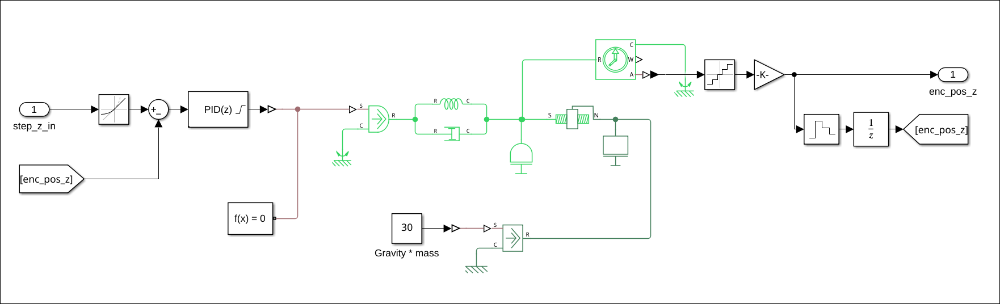

# Modeling

## Overview
The architecture is built using MATLAB/Simulink and Simscape, following a Multi Domain Model Design approach. The system is explicitly divided into two referenced models to separate the discrete software logic from the continuous physical plant:

* `control_<axis>`: The discrete-time control algorithm (firmware replica).
* `machine_<axis>`: The continuous-time physical model (Simscape Multibody/Foundation).

The repository is available [here](https://github.com/DEDALUS-5x/machine-model).

## Top-Level Integration
The top-level model connects the control logic and the physical plant. Since the controller operates in the discrete-time domain (simulating an STM32 microcontroller) and the physical plant operates in the continuous-time domain, appropriate interface blocks are utilized:

* **Zero-Order Hold (ZOH):** Applied to the continuous feedback signals (position and velocity) entering the controller. This mimics the finite sampling rate of the microcontroller's ADCs and timers.
* **Unit Delay ($z^{-1}$):** Placed between the controller's PWM output and the plant's input. This breaks the algebraic loop, accurately simulating the computational delay (e.g., 100 $\mu s$) between reading the encoders and updating the motor driver.

## X: Extruder Axis

### Control sub-Model
The control logic features a discrete cascade PID architecture with feedforward compensation, matching the physical C firmware structure:

* **Outer Position Loop (1 kHz):** Computes the positional error. The positional feedback is quantized to simulate the finite resolution of the RLS linear encoder. The output of this `PID(z)` is a baseline velocity command.
* **Velocity Feedforward:** The target feedrate is directly summed with the output of the position PID. This acts as a primary driving signal, allowing the position PID to operate purely as a low-effort error corrector (usually purely Proportional), avoiding heavy oscillations.
* **Inner Velocity Loop (10 kHz):** Compares the feedforward-adjusted target velocity against the quantized feedback from the AS5048A rotary encoder. This highly responsive `PID(z)` outputs a normalized duty cycle, which is then amplified by the system voltage (e.g., 12V) to command the physical motor.

### Physical Plant sub-Model
The plant is modeled using the Simscape Foundation Library, employing a physical network approach rather than purely signal-based mathematical blocks. This ensures accurate bidirectional power flow and energy conservation across different physical domains (Electrical, Rotational, and Translational).

#### Domain Boundary and Electrical Circuit
The flow begins with the `pwm_in` signal coming from the discrete controller. Since this is a standard Simulink mathematical signal, it first passes through a **Simulink-PS Converter** to enter the physical domain. 
This signal drives a **Controlled Voltage Source**, establishing the electrical circuit against an **Electrical Reference** (ground). The generated voltage powers the **DC Motor** block, which is parameterized with real-world electrical constraints (armature resistance, inductance, and back-EMF) and mechanical rotor inertia.

#### Rotational Mechanics and Sensing
The **DC Motor** converts electrical power into mechanical rotational power. Its casing is anchored to a **Mechanical Rotational Reference**, while the shaft output connects to a primary rotational node. From this node, the network branches out to handle both sensing and power transmission:

* **Velocity Feedback:** An **Ideal Rotational Motion Sensor** taps into the shaft to measure the angular velocity. The physical measurement is sent through a **PS-Simulink Converter** to become the `enc_vel_out` signal, feeding the inner PID loop.
* **Torque Monitoring:** An **Ideal Torque Sensor** is placed in series with a secondary ground to measure the effort generated by the motor, outputting the data to a Scope (`Torque monitor`) for tuning and diagnostic purposes.

#### Transmission and Flexible Coupling
The main rotational power flows into a **Wheel and Axle** block, which acts as the drive pulley, converting the angular motion into linear displacement. 
Crucially, the timing belt connecting the pulley to the carriage is not modeled as a perfectly rigid link. The linear output passes through a parallel combination of a **Translational Spring** and a **Translational Damper**. This setup accurately captures the mechanical compliance, structural resonance, and internal high-frequency energy dissipation ("ringing") inherent in belt-driven systems.

#### Linear Dynamics and Position Feedback
Following the flexible transmission, the linear force pulls the **Mass** block, representing the physical weight and inertia of the extruder carriage. 
To simulate the viscous friction of the linear recirculating ball bearing guides, a secondary **Translational Damper** is connected between the mass and the **Mechanical Translational Reference** (the physical ground of the machine).
Finally, an **Ideal Translational Motion Sensor** is connected to the carriage mass. It reads the absolute physical position without drawing energy from the system, passing the measurement through a **PS-Simulink Converter** to generate the `enc_pos_out` signal for the outer positional PID loop.

## Y: Printing Plate Axis

### Control sub-Model
The control logic for the Y-axis utilizes the exact same discrete cascade PID architecture with velocity feedforward as the X-axis. By leveraging Simulink's Model Reference arguments, the identical control model is instantiated with a specific set of tuning parameters ($K_p$, $K_i$, $K_d$, and saturation limits) tailored to the heavier load and different resonant frequencies of the Y-axis.

#### Rotational Axis Control
As regards the additional A and C axis (respectively global pitch and plate-local yaw), control law is simplified: at first, stepper motors are used, and second, just the rotating encoder `AS5048A` is embedded on the rotating shaft. Thanks to that, it is possible to implement a fast PID (10kHz frequency) by means of just Proportional gain. Derivative and Integral term are null for the C axis, while the A axis uses a small derivative term in order to smooth the kickback to the Y-axis carriage.

### Physical Plant sub-Model
The core physical network (`machine_y`), encompassing the electro-mechanical conversion (DC Motor) and the flexible transmission (belt elasticity and damping), remains structurally identical to the extruder axis. However, the load characteristics are significantly more complex due to the multi-axis mechanical linkages.

#### Coupled Mass and Parasitic Dynamics of Pitch Rotation
The primary distinction in the Y-axis physical model lies in the **Mass** block and its external inputs. The Y-axis carriage supports the entire printing plate and the rotating cradle (Pitch axis). 

Crucially, because the center of gravity of the cradle is not perfectly aligned with the Y-axis linear guides, any rotational acceleration of the Pitch axis generates a leverage effect. This results in parasitic linear reaction forces (kickback) acting directly on the Y-axis carriage. To accurately simulate this coupled dynamic, the Y-axis mass system is modeled to receive these reaction forces as external physical disturbances. This ensures the simulation accurately represents the real-world scenario where the Y-axis cascade controller must actively reject sudden load changes to maintain tracking accuracy during simultaneous 5-axis movements.

#### Yaw-Rotating Printing Plate
On the other hand, the printing plate also rotates on its own Z axis, resulting the 5 global printing axis. The model of the rotating plate is basically the same of the rotating Y-axis carriage, by differentiating it just for the mass and damping values.

## Z: Vertical Positioning Axis

Unlike the X and Y axes, which utilize closed-loop DC motors for high-speed dynamic movements, the Z-axis is responsible for precise, low-speed vertical positioning. As poisitioning axis, a stepper motor is exploited. 
The input `step_z_in` is a standardized signal representing the desired discrete steps.

The Z-axis physical model translates discrete step commands into physical vertical motion, factoring in the unique properties of a lead screw transmission.

### Stepper Translation
The input step signal is passed through an **Ideal Torque Source** (via a Gain block to convert steps to velocity). This enforces a strict kinematic translation profile, simulating the rigid holding torque and discrete stepping nature of the motor without modeling the complex electromagnetics of the stepper coils.
This is just a modeling escamotage.

### Transmission and Leadscrew Dynamics
The core element of the Z-axis is the **Translational Spring** and **Translational Damper** assembly, acting as a flexible coupling between the ideal step source and the physical carriage. This captures the mechanical compliance (backlash and axial deformation) of the lead screw nut when subjected to varying loads. The rotational-to-linear conversion of the lead screw is abstracted into the step-to-translation gain.

### Mass and Gravity Bias
The entire weight of the gantry acts continuously on the Z-axis. This is modeled using an **Ideal Force Source** injecting a constant downward force equal to `Gravity * mass` ($9.81 \cdot 3$ kg). The carriage itself is represented by a **Mass** block, and a **Translational Damper** simulates the friction of the vertical rails. This setup ensures the system accurately models the asymmetrical effort required to lift the gantry versus lowering it, and the resting deflection of the flexible transmission.

## Model validation

Before deploying advanced model-based control strategies, it is strictly necessary to validate the fidelity of the Simscape physical network. The objective of this phase is to ensure that the FMU (Digital Twin) accurately replicates the dynamic behavior of the real 5-axis kinematics when subjected to the same stimuli.

To achieve this, an open-loop and closed-loop validation procedure was conducted. The physical machine and the FMU were fed identical trajectory profiles (position and velocity setpoints), and their respective outputs were logged and compared.

### Trajectory Tracking Comparison
A standard testing routine—comprising sharp accelerations, cruising speeds, and direction reversals—was executed on the physical hardware. The identical control signals were passed to the FMU running in parallel. 

As observed in the plot, the baseline 1D multidomain model successfully captures the dominant dynamics of the system. The mechanical compliance (belt stretching), the inertial resistance, and the Pitch-to-Y kickback coupling are faithfully simulated, maintaining the simulated trajectory within an acceptable error margin from the physical ground truth.

### Residual Error and the Need for Adaptation
The residual tracking errors expose a fundamental limitation of static modeling: **parameter variability**. 

While geometric constants (like the center of gravity distance $d_{CG}$ or motor torque constants $K_t$) remain fixed, other crucial parameters change continuously during operation:
1. **Dynamic Payload:** The equivalent mass of the Y-axis and the rotational inertia of the Pitch and Yaw axes increase steadily as plastic material is extruded onto the printing plate.
2. **Thermal Variations:** The viscous friction coefficients ($B$) of the linear guides and the belt damping factors vary as the mechanical components heat up during long printing sessions.

Relying on a statically calibrated FMU would lead to a progressive deterioration of the feedforward compensation and model-predictive features. To bridge this gap and achieve perfect alignment between the Digital Twin and the physical machine, the static parameters must be dynamically updated. This requirement naturally introduces the implementation of an **Online Parameter Identification** strategy.