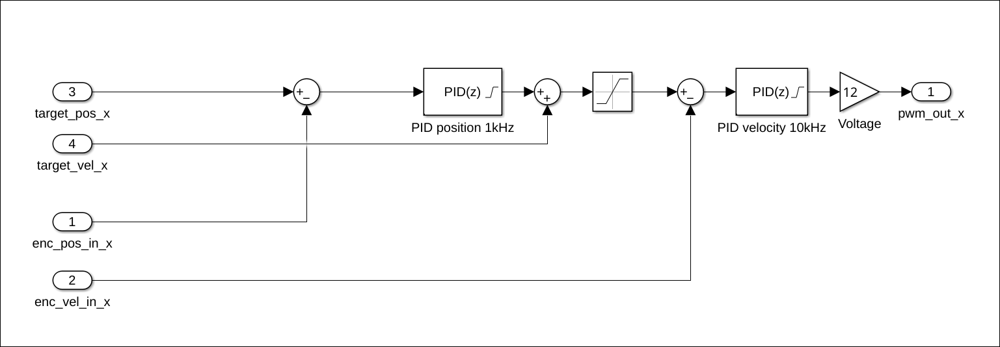
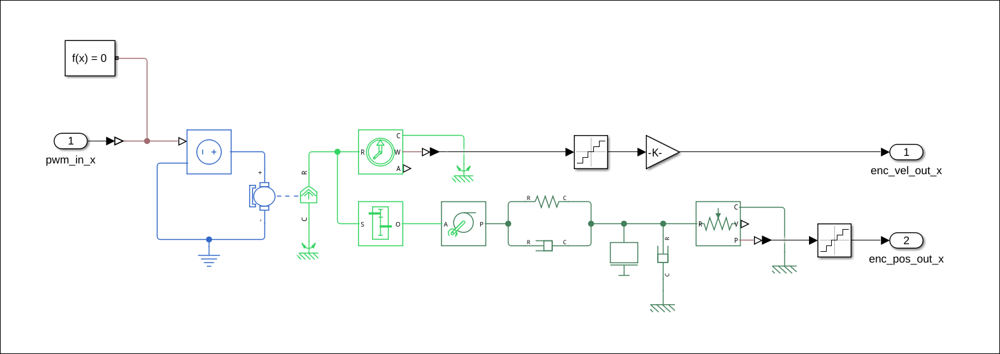
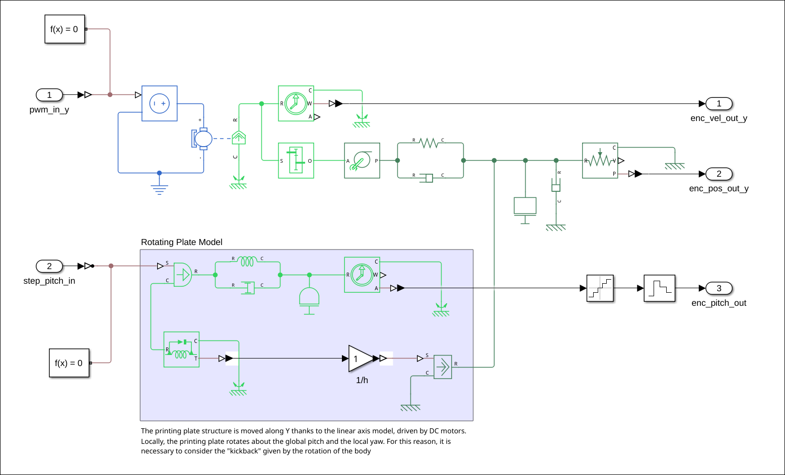

# Modeling

## Overview
The architecture is built using MATLAB/Simulink and Simscape, following a Multi Domain Model Design approach. The system is explicitly divided into two referenced models to separate the discrete software logic from the continuous physical plant:

* `control_<axis>`: The discrete-time control algorithm (firmware replica).
* `machine_<axis>`: The continuous-time physical model (Simscape Multibody/Foundation).

## Top-Level Integration
The top-level model connects the control logic and the physical plant. Since the controller operates in the discrete-time domain (simulating an STM32 microcontroller) and the physical plant operates in the continuous-time domain, appropriate interface blocks are utilized:

* **Zero-Order Hold (ZOH):** Applied to the continuous feedback signals (position and velocity) entering the controller. This mimics the finite sampling rate of the microcontroller's ADCs and timers.
* **Unit Delay ($z^{-1}$):** Placed between the controller's PWM output and the plant's input. This breaks the algebraic loop, accurately simulating the computational delay (e.g., 100 $\mu s$) between reading the encoders and updating the motor driver.

## X: Extruder Axis

### Control sub-Model
The control logic features a discrete cascade PID architecture with feedforward compensation, matching the physical C firmware structure:

* **Outer Position Loop (1 kHz):** Computes the positional error. The positional feedback is quantized to simulate the finite resolution of the RLS linear encoder. The output of this `PID(z)` is a baseline velocity command.
* **Velocity Feedforward:** The target feedrate is directly summed with the output of the position PID. This acts as a primary driving signal, allowing the position PID to operate purely as a low-effort error corrector (usually purely Proportional), avoiding heavy oscillations.
* **Inner Velocity Loop (10 kHz):** Compares the feedforward-adjusted target velocity against the quantized feedback from the AS5048A rotary encoder. This highly responsive `PID(z)` outputs a normalized duty cycle, which is then amplified by the system voltage (e.g., 12V) to command the physical motor.

### Physical Plant sub-Model
The plant is modeled using the Simscape Foundation Library, employing a physical network approach rather than purely signal-based mathematical blocks. This ensures accurate bidirectional power flow and energy conservation across different physical domains (Electrical, Rotational, and Translational).

#### Electro-Mechanical Conversion
The control signal (voltage) drives a **Controlled Voltage Source**, which powers a **DC Motor** block. The motor block is parameterized with real-world electrical constraints (armature resistance, inductance, and back-EMF) and mechanical properties (rotor inertia). 

#### Transmission and Elasticity
The rotational output of the motor is converted to linear motion via a **Wheel and Axle** block, representing the drive pulley. 
Crucially, the timing belt is not modeled as a rigid link, but as a flexible transmission using parallel **Translational Spring** and **Translational Damper** blocks. This captures the structural resonance and high-frequency oscillations ("ringing") inherent in belt-driven systems.

#### Mass and Friction Dynamics
The linear force from the belt drives the **Mass** block, representing the extruder carriage. A secondary **Translational Damper** connected to the mechanical ground simulates the minimal viscous friction of the linear recirculating ball bearing guides.

#### Sensor Interfaces
Feedback is gathered using **Ideal Rotational** and **Ideal Translational Motion Sensors**. These blocks read the physical states without drawing energy from the system, converting the physical quantities back into standard Simulink signals for the control loops.

## Y: Printing Plate Axis

### Control sub-Model
The control logic for the Y-axis utilizes the exact same discrete cascade PID architecture with velocity feedforward as the X-axis. By leveraging Simulink's Model Reference arguments, the identical control model is instantiated with a specific set of tuning parameters ($K_p$, $K_i$, $K_d$, and saturation limits) tailored to the heavier load and different resonant frequencies of the Y-axis.

### Physical Plant sub-Model
The core physical network (`machine_y`), encompassing the electro-mechanical conversion (DC Motor) and the flexible transmission (belt elasticity and damping), remains structurally identical to the extruder axis. However, the load characteristics are significantly more complex due to the multi-axis mechanical linkages.

#### Coupled Mass and Parasitic Dynamics
The primary distinction in the Y-axis physical model lies in the **Mass** block and its external inputs. The Y-axis carriage supports the entire printing plate and the rotating cradle (Pitch axis). 

Crucially, because the center of gravity of the cradle is not perfectly aligned with the Y-axis linear guides, any rotational acceleration of the Pitch axis generates a leverage effect. This results in parasitic linear reaction forces (kickback) acting directly on the Y-axis carriage. To accurately simulate this coupled dynamic, the Y-axis mass system is modeled to receive these reaction forces as external physical disturbances. This ensures the simulation accurately represents the real-world scenario where the Y-axis cascade controller must actively reject sudden load changes to maintain tracking accuracy during simultaneous 5-axis movements.

