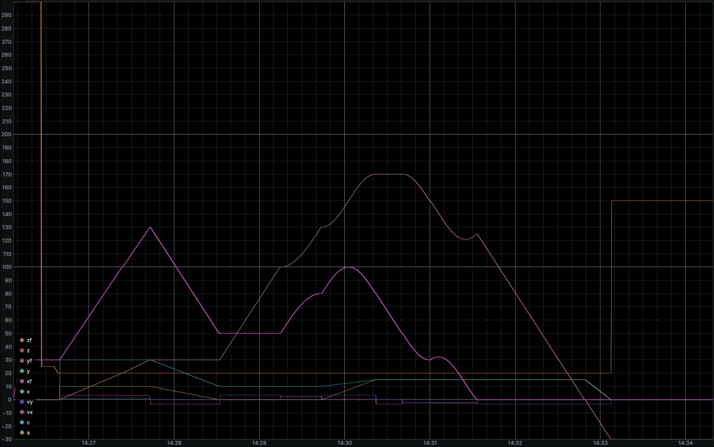

# Low-Level Kernel
The low-level software is based on 3-axes [cncpp](https://github.com/pbosetti/cncpp) one, that is the outcome of the **Precision Engineering Mod.2** course. It implements:

* `G Code` parsing;
* Motion profiles computation;
* `MQTT` interface for fast movements that require feedbacks from the machine.

The used [fork](https://github.com/DEDALUS-5x/cncppevo) additionally implements:

* 2 additional positioning axes;
* Tool Radius Compensation;
* Lookhaed feedrate smoothing;
* MADS framework interface in change of `MQTT` communication.

## MADS Interface

The software kernel runs by its own since it is fed with a valid `G Code` and a `yml` file as machine parameters configuration file. It is needed to interface it with the [MADS](https://github.com/pbosetti/MADS.git) environment.

MADS is a cross-plattform broker-based framework that can be used to run different agents on multiple machines. Its strenght stands on the idea to be a plug-and-play, robust and efficient software. In this case, it is used to interface the low-level kernel with both the real machine and a simulation environment based on Matlab Simulink.

MADS is a ZeroMQ-based framework, so it is needed to interface the low-level kernel with the MADS network. From this need the dedicated monolithic agent arises. This agent directly interfaces with the already structured FSM thanks by following the [fsm guide](https://mads-net.github.io/guides/fsm.html).

While the interested data is sent through the MADS communication network, it is possible to both interface with the real machine and simulation environment by respectively using the agents [spi_agent](https://github.com/alterlleo/spi_agent.git) and [fmu_agent](https://github.com/MADS-NET/FMU_agent.git).

### Machine

The `spi_agent` is a monolithic MADS agent specifically designed for the Raspberry Pi 5 to communicate with the Axes Controller Board (STM32H7) via the SPI peripheral. It implements a high-performance Full-Duplex logic, allowing simultaneous reading and writing during every loop cycle.
Binary Protocol and Memory Alignment

To ensure total compatibility between the ARM architecture of the Raspberry Pi and the MCU of the controller board, the communication protocol uses strict 1-byte alignment (via `#pragma pack(push, 1)`) to prevent memory padding issues.

#### TX: Raspberry Pi → Microcontroller
Sent whenever a valid JSON message is received from the MADS network.
- **Total Size**: 32 Bytes
- **Structure (`Pack`)**:
  
| Offset | Type | Field | Description |
| :--- | :--- | :--- | :--- |
| 0 | `uint8_t` | `start` | Start Byte: `0xAA` |
| 1 | `float` | `x` | X-axis coordinate (4 bytes) |
| 5 | `float` | `y` | Y-axis coordinate (4 bytes) |
| 9 | `float` | `z` | Z-axis coordinate (4 bytes) |
| 13 | `float` | `a` | Pitch/Rotation (4 bytes) |
| 17 | `float` | `c` | Yaw/Rotation (4 bytes) |
| 21 | `float` | `vx`| Target velocity, x component, (4 bytes) |
| 25 | `float` | `vy`| Target velocity, y component, (4 bytes) |
| 29 | `uint8_t` | `check` | XOR Checksum of bytes 0-28 |
| 30 | `uint8_t` | `padding[66]` | Padding

#### RX: Microcontroller → Raspberry Pi
Read during every agent loop cycle to update the machine status.
- **Total Size**: 32 Bytes
- **Structure (`PackFb`)**:

| Offset | Type | Field | Description |
| :--- | :--- | :--- | :--- |
| 0 | `uint8_t` | `start` | Start Byte: `0xBB` |
| 1 | `uint32_t`| `msg_id`| Sequence ID (only newer IDs are processed) |
| 5 | `float` | `xf` | Current X position (4 bytes) |
| 9 | `float` | `yf` | Current Y position (4 bytes) |
| 13 | `float` | `zf` | Current Z position (4 bytes) |
| 17 | `float` | `af` | Current A position (4 bytes) |
| 21 | `float` | `cf` | Current C position (4 bytes) |****
| 25 | `float` | `error` | Current tracking error (4 bytes) |
| 29 | `uint8_t` | `check` | XOR Checksum of bytes 0-28 |
| 30 | `uint8_t` | `padding[26]` | Padding

---

### Simulator

When the real hardware is not available, Dedalus uses the [FMU_agent](https://github.com/MADS-NET/FMU_agent#) to interface the motion kernel with a **Digital Twin**.

An FMU (Functional Mock-up Unit) is a file (ending in `.fmu`) that contains a simulation model following the FMI (Functional Mock-up Interface) standard. It allows models developed in environments like MATLAB Simulink or Modelica to be exported and executed as independent functional blocks within other software.
Simulation Workflow

The `FMU_agent` acts as a bridge between the MADS communication network and the virtual model:

* **Dynamic Modeling**: The FMU contains the physical equations of the Dedalus axes, including motor torque constants, mass of the 3kg cradle, and friction of the MGN15 guides.
* **Deterministic Execution**: The agent steps the simulation forward in time, receiving the same JSON setpoints that would normally be sent to the SPI agent.
* **Closed-Loop Feedback**: The FMU calculates the resulting virtual position and sends it back to the MADS network as feedback. This allows the motion kernel to validate the G-code execution and the Feedforward/PID logic in a safe, virtual environment before deployment.

For this application, the `FMU_agent` is exploited in `trigger mode`: the agent is triggered whenever an input occurs. In this way, the real-time clock runs on the master agent, that is the same that runs the FSM. The FMU is subjected to this clock, in order to get a synchronized simulation. Since the machine model implements a discrete controller and it is exported within a fixed-step integrator, it is required to get to the exported plant a time interval equal to a multiple of the integration `dt`.
For this reason, a dedicated implementation on the `FMU_agent` is developed.

The virtual model is exported from `Matlab Simulink` and, in particular, it is exported as **Co-Simulation 3.0**. It is currently tested with the `ode14x` and `0.0001s` as fixed step. 

In this figure, it is shown the full simulation of a generic `G-Code` in which it is imposed a generic path with also some rotative axis inclinations:
